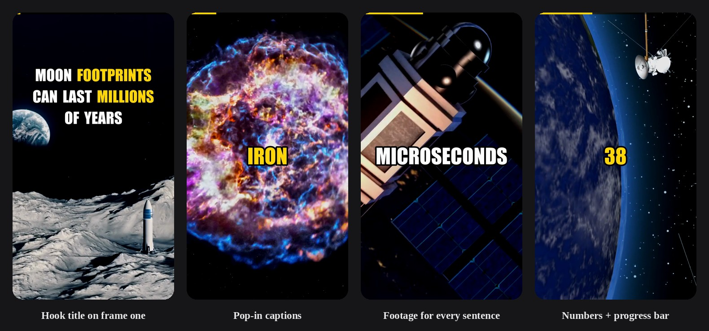
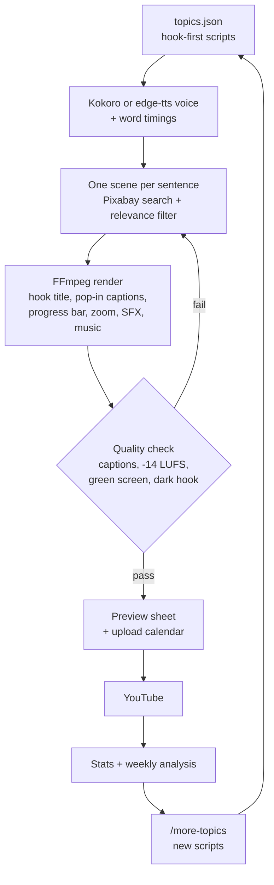

# AI Shorts Generator

[](https://github.com/makdogan2/ai-shorts-generator/actions/workflows/tests.yml)

A free, fully automated pipeline that turns short text scripts into ready-to-upload vertical videos for **YouTube Shorts, TikTok and Instagram Reels**. One shared engine runs any number of channels ("niches"), each with its own scripts, voice, colors and music.

Write the scripts once. The pipeline handles the AI voiceover, stock footage, word-by-word captions, background music and the final 1080×1920 render, then writes the title, description and hashtags for you.



*Frames from real videos on the [Astro Pocket](https://www.youtube.com/@TheAstroPocket) YouTube channel, rendered end to end by this pipeline.*

## How it works



The loop is the point: performance numbers decide which hooks, topics and upload times the next batch uses.

## Results

First week of the Astro Pocket channel, all videos made with this engine:

| Metric | First week |
|---|---|
| Views | 5.1K |
| Subscribers gained | +14 |
| Average "stayed to watch" | ~39% |
| Best Short | ~1.3K views |

What the data changed:

- Viewers who stayed watched 80–100% of each video, but most swipes happened in the first second. That led to the hook title on frame one, a first scene that always shows the hook's subject, and a quality check that re-renders videos with a dark first frame.
- Videos published at 02:00 Turkey time (evening in the US) clearly beat the 19:00 slot, so the default calendar moved to 02:00 and 22:00.
- Captions vanished after a cut on some renders. The cause was an FFmpeg 7 filter re-initialization on mixed color tags; it is fixed and guarded by a regression test that renders real video.

## Features

- **Multi-niche.** Every folder in `niches/` is a channel with its own scripts and settings. One command renders them all.
- **Free neural voiceover.** [Kokoro](https://github.com/thewh1teagle/kokoro-onnx), an open-source (Apache 2.0) voice model that runs on your own computer, or Microsoft Edge voices through `edge-tts` for other languages. Kokoro voices each sentence separately and times every word inside it, using the pauses it hears at commas. No paid TTS API needed.
- **Footage that matches every sentence.** Give each sentence its own search (`visuals`) and every scene cuts on a sentence boundary with footage of what is being said. Without it, clips come from the topic keywords and the niche's fallback searches. For the opening scene the engine downloads several candidates and measures each one's first 1.5 seconds: dark clips drop to the bottom, and among the bright ones the clip with the most movement wins, because viewers decide to swipe in the first half second.
- **Pop-in, word-by-word captions.** Big centered captions synced to the voice, each word popping in with a quick scale animation. Numbers and chosen keywords are highlighted in the niche's color.
- **Hook title on the first frame.** The whole opening claim is on screen from frame one, so viewers read it before they decide to swipe.
- **Progress bar.** A thin bar in the highlight color fills up across the video, so viewers see how short it is.
- **Automatic quality check.** After every render the engine checks that captions stay on screen for the whole voiceover, that loudness is on target and that the video is under 60 seconds. A failed video is re-rendered with different clips; if it still fails it is saved as `*.HATALI.mp4` so it never gets uploaded by mistake.
- **Works without API keys.** With no key, it renders an animated gradient background, optionally with a drifting starfield.
- **Built-in sound effects.** Original, synthesized whooshes land exactly on every scene cut, with a boom on the hook cut. No licensing needed.
- **Background music with auto-mixing.** Each video gets a track (chosen per topic or automatically). Quiet intros are skipped, and the music is leveled under the voice and faded in and out.
- **Loudness-normalized output.** Every video is mixed to −14 LUFS, YouTube's playback standard, so it never plays quieter than other Shorts.
- **Upload-ready metadata and calendar.** Each video gets a `.txt` with its title, description and hashtags. After every run, new videos are placed on the next free publishing slots and `yukleme_plani.txt` lists the time, title, description and comma-separated YouTube tags for each one.
- **Batch and resume.** Videos that already exist are skipped.
- **One-click Windows setup.** `kurulum.bat` installs everything, including FFmpeg via winget. Also runs on macOS and Linux.

## Web app

**https://makdogan2.github.io/ai-shorts-generator/**

Pick ready-made channels or type your own niche, then download the complete kit as one ZIP. Custom niches are written by Claude using your own Anthropic API key, which stays in your browser and goes straight to Anthropic. The site has no server and reads the channels directly from this repository, so adding a folder to `niches/` (and to `niches/index.json`) publishes it on the site.

## Quick start

### Windows

1. Double-click `kurulum.bat`. It installs the Python packages and FFmpeg, then asks for an optional Pixabay key.
2. Double-click `calistir.bat` to render every niche. To render a single niche, run `calistir.bat space`.

Videos appear in `output/<niche>/`. A niche that uses the Kokoro voice downloads the voice model once on its first run (about 350 MB, into `models/`). The setup scripts and console messages are in Turkish.

### macOS / Linux

```bash
pip install -r requirements.txt       # FFmpeg must also be installed
python pipeline.py                     # all niches
python pipeline.py space psychology    # selected niches
python pipeline.py --list              # niches and progress
python pipeline.py --check space       # run the quality check on finished videos
python pipeline.py --validate space    # check scripts against the rules (length, hook, visuals)
python pipeline.py --preview space     # one image with a frame per second of the newest videos
python pipeline.py --plan space        # upcoming publishing calendar
```

## Project layout

```
pipeline.py                 shared engine
muzik/                      shared music pool (used when a niche has no music of its own)
niches/
  space/
    settings.json           voice, colors, tags, fallback searches
    topics.json             scripts
    muzik/                  niche-specific music (optional)
  psychology/
    ...
output/<niche>/             rendered videos (git-ignored)
cache/                      downloaded stock clips, shared by all niches (git-ignored)
```

Two example niches are included: **space** (space and physics scripts) and **psychology** (14 psychology scripts).

## Add a niche with Claude Code

If you have a Claude Pro or Max plan, you can create a niche without an API key. Clone the repo, open Claude Code in the folder and run:

```
/new-niche deep sea creatures 10
```

Claude writes `niches/<name>/settings.json` and hook-first, fact-checked scripts in `topics.json`, registers the niche in `niches/index.json`, and tells you how to render it.

To keep a channel going, add more scripts to an existing niche:

```
/more-topics space 10
```

Claude reads the niche's existing scripts so nothing repeats, checks every number on the web, writes footage searches for each sentence, and runs `python pipeline.py --validate space` before it hands over. `CLAUDE.md` explains the project to Claude Code. Open a pull request to share your niche; once merged it shows up on the website.

## Adding a niche

Copy an existing folder in `niches/`, rename it, then edit its `settings.json` and `topics.json`, and add it to `niches/index.json`. It will be picked up automatically on the next run.

### `settings.json`

| Setting | What it controls |
|---|---|
| `channel` | Display name shown in the console |
| `tts` | `"kokoro"` (open-source, runs offline, English) or `"edge"` (Microsoft Edge voices, any language; default) |
| `voice`, `rate` | Narrator voice and speed: a Kokoro voice such as `af_heart`, `am_michael`, `bm_george`, or any `edge-tts` voice |
| `fallback_queries` | Generic footage searches used when a topic has no results |
| `default_tags` | Hashtags used when a topic has none |
| `highlight_color` | Caption highlight color |
| `starfield` | Drifting stars on the keyless gradient background |
| `palettes` | Gradient colors for keyless mode |
| `scene_seconds` | How long each stock clip stays on screen before cutting |
| `first_scene_seconds` | Optional quick first cut (e.g. `1.5`) right after the hook |
| `music` | `true` to add background music, `false` to skip it |
| `music_rel_db` | How far the music sits below the voice (dB) |
| `music_fade_in` | Seconds of music fade-in (`0` = full energy from the first frame) |
| `sfx` | Synthesized whoosh on every cut and a deep boom on the first cut |
| `sfx_rel_db` | How far the effects sit below the voice (dB) |
| `caption_pop` | Pop-in animation for each caption word (default `true`) |
| `progress_bar` | `"top"` (default), `"bottom"` or `false` |
| `hook_title` | Show the hook sentence as a big title from the very first frame (default `true`) |
| `zoom` | Gentle push-in / pull-out on every scene (default `0.08`, `0` turns it off) |
| `upload_slots` | Publishing times used for the upload plan (default `["02:00", "22:00"]`) |
| `base_tags` | Channel tags added to every video's YouTube tags |

Missing settings fall back to sensible defaults.

**Hook tip:** open every script with a shocking claim or question that lands within the first 1.5 seconds ("Paper can reach the Moon."). Pair it with `first_scene_seconds: 1.5` so the first cut hits right as the hook ends.

### `topics.json`

```json
{
  "slug": "unique-video-id",
  "title": "Hook-style video title",
  "script": "The voiceover text, around 35-40 words for a 15-second short.",
  "keywords": "moon",
  "visuals": ["folded paper", "stack of paper", "moon"],
  "highlight": ["Moon"],
  "description": "One-line description for the upload.",
  "tags": "#space #science #shorts",
  "music": "track-name.mp3",
  "music_start": 30
}
```

| Field | Purpose |
|---|---|
| `slug` | Unique file name for the video |
| `script` | Text that gets voiced and captioned |
| `keywords` | Stock footage search, 1–2 English words work best. A list like `["moon", "paper"]` mixes clips from several searches |
| `visuals` | Optional: one footage search per sentence, in order. Each sentence becomes its own scene (long ones are split) |
| `highlight` | Words shown in the highlight color, in addition to numbers |
| `title`, `description`, `tags` | Written to the upload `.txt` |
| `music`, `music_start` | Optional: a track from the niche's or shared `muzik/` folder, and the second to start from |

## Tests

```bash
pip install pytest
python -m pytest tests
```

Unit tests cover word timing, scene planning, stock-footage filtering and caption images. Render tests build real
videos from synthetic clips and run the quality check on them; they need FFmpeg. GitHub Actions runs everything on
every push, rendering with FFmpeg 7 like Windows installs do.

## API keys

Both keys are free and optional:

- **Pixabay:** https://pixabay.com/api/docs/
- **Pexels:** https://www.pexels.com/api/

Put a key in `pixabay_key.txt` or `pexels_key.txt`, or set the `PIXABAY_API_KEY` / `PEXELS_API_KEY` environment variables. Key files are listed in `.gitignore` and never get committed.

## Responsible use

Only embed music you have the rights to use (YouTube Audio Library, Pixabay Music, public-domain recordings). Copyrighted songs embedded in the file trigger Content ID claims; add those through the YouTube app's sound picker instead. Music files are git-ignored.

Check your facts before publishing. Review YouTube's monetization policies on repetitive or mass-produced content, and add your own angle, voice or editing so each channel offers something original.
